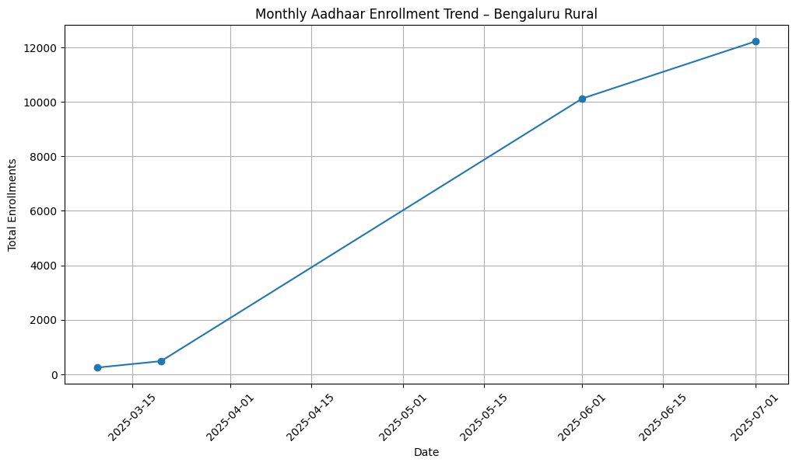

<div align="center">

# 📊 Aadhaar Enrollment Trend & Anomaly Detection

**AI-assisted trend and anomaly analysis of public Aadhaar enrollment data for sustainable digital governance**

[](https://www.python.org)
[](https://jupyter.org)
[](LICENSE)
[](https://uidai.gov.in)
[](https://sdgs.un.org/goals/goal11)

</div>

---

## Overview

This project analyses **public Aadhaar enrollment data** for **Bengaluru Urban district, Karnataka**, identifying long-term enrollment trends and detecting statistical anomalies using **AI-assisted methods**.

The goal is **sustainable digital governance** — using data-driven, transparent, and responsible AI to support proactive administrative decision-making.

---

## Screenshots

> **Monthly Enrollment Trend** — total enrollment volume over time across all age groups



> **Age-wise Breakdown** — comparative enrollment trends across the 0–5, 5–17, and 18+ age groups


> **Anomaly Detection** — Z-score based flagging of statistically significant enrollment spikes and drops


---

## Project Context

UIDAI Aadhaar enrollment services generate a very large volume of data over time. However, **sudden drops, spikes, or irregular patterns** in the enrollment process often go unnoticed when monitoring is manual or delayed.

This project addresses that gap by building an **AI-assisted analytical decision-support system** that automatically highlights trends and anomalies to support proactive governance using data insights.

### Problem Statement

Uneven and unpredictable Aadhaar enrollment patterns can impact equitable access to digital identity services. Without automated analysis, anomalies may delay administrative response and affect service availability, especially in semi-urban and rural regions.

---

## How It Works

```
┌─────────────────────┐
│   Load CSV Dataset  │
│  (Pandas read_csv)  │
└──────────┬──────────┘
           │
           ▼
┌─────────────────────┐
│   Data Cleaning &   │
│   Preprocessing     │
│  (parse dates, sort,│
│   drop nulls)       │
└──────────┬──────────┘
           │
           ▼
┌─────────────────────┐
│ Feature Engineering │
│  total_enrollment   │
│  monthly_growth %   │
└──────────┬──────────┘
           │
           ▼
┌─────────────────────┐
│   Trend Analysis    │
│  (overall + age-    │
│   wise line plots)  │
└──────────┬──────────┘
           │
           ▼
┌─────────────────────┐
│  Z-Score Anomaly    │
│     Detection       │
│  (flag  |z| > 2 )   │
└──────────┬──────────┘
           │
           ▼
┌─────────────────────┐
│  Visualization &    │
│  Interpretation     │
│  (plots + flagged   │
│   records table)    │
└─────────────────────┘
```

---

## Role of AI

AI is used in the form of **statistical pattern and anomaly detection** — a valid, explainable AI approach for analytical decision-support systems.

**Key AI components:**
- Automated trend analysis over time
- Statistical anomaly detection using Z-score
- Scalable and repeatable pattern identification
- Transparent and interpretable logic (no black-box models)

> Advanced generative AI models (LLMs, RAG, Agentic AI) were intentionally **not used** to ensure **responsibility, explainability, and ethical compliance**.

---

## Dataset

| Attribute | Details |
|---|---|
| **Source** | Publicly available, aggregated Aadhaar enrollment statistics ([UIDAI](https://uidai.gov.in)) |
| **Region** | Bengaluru Urban district, Karnataka |
| **Granularity** | Monthly (aggregated by date and PIN code) |
| **Format** | CSV |

**Columns:**

| Column | Description |
|---|---|
| `date` | Enrollment month (DD-MM-YYYY) |
| `state` | State name |
| `district` | District name |
| `pincode` | PIN code of enrollment center |
| `age_0_5` | Enrollments for age group 0–5 |
| `age_5_17` | Enrollments for age group 5–17 |
| `age_18_greater` | Enrollments for age group 18+ |

> No personal, biometric, or sensitive data is used in this project.

---

## Requirements

- **Python 3.8+**
- **pip** (standard with Python)

| Package | Version | Purpose |
|---|---|---|
| `pandas` | Latest | Data loading and manipulation |
| `matplotlib` | Latest | Visualization |
| `scipy` | Latest | Z-score statistical computation |
| `notebook` | Latest | Running Jupyter notebooks |

---

## Installation & Setup

### 1. Clone the Repository

```bash
git clone https://github.com/praveshjainnn/Aadhar-Enrollment-Anomaly-Detection.git
cd Aadhar-Enrollment-Anomaly-Detection
```

### 2. Create a Virtual Environment (Recommended)

```bash
# Create virtual environment
python -m venv venv

# Activate — Windows
venv\Scripts\activate

# Activate — macOS / Linux
source venv/bin/activate
```

### 3. Install Dependencies

```bash
pip install -r requirements.txt
```

### 4. Launch Jupyter Notebook

```bash
jupyter notebook
```

A browser tab will open. Navigate to `Notebook/` and open `Analysis.ipynb`.

### 5. Run the Analysis

In Jupyter: **Kernel → Restart & Run All**

---

## Output

Running the notebook produces the following outputs:

| Output | Location | Description |
|---|---|---|
| Monthly trend chart | `Visuals/monthly_trend.png` | Total enrollment over time |
| Age-wise trend chart | `Visuals/Age-wise plot.png` | Enrollment split by age group |
| Anomaly detection chart | `Visuals/Anomaly plot.png` | Z-score flagged data points |
| Anomaly records table | Notebook cell output | DataFrame of all flagged anomalies |

---

## Project Structure

```
Aadhar-Enrollment-Anomaly-Detection/
│
├── Data/
│   └── aadhar_enrollment_bengaluru_rural.csv   # Public dataset (CSV)
│
├── Notebook/
│   └── Analysis.ipynb                          # Main Jupyter analysis notebook
│
├── Visuals/
│   ├── monthly_trend.png                       # Monthly total enrollment plot
│   ├── Age-wise plot.png                       # Age-group breakdown plot
│   └── Anomaly plot.png                        # Z-score anomaly detection plot
│
├── README.md                                   # Project documentation
├── requirements.txt                            # Python dependencies
└── .gitignore
```

---

## Methodology

| Step | Description |
|---|---|
| 1️⃣ Data Loading | Load CSV and inspect structure |
| 2️⃣ Data Cleaning | Parse dates, handle nulls, sort by time |
| 3️⃣ Feature Engineering | Compute `total_enrollment` and `monthly_growth` rate |
| 4️⃣ Trend Analysis | Plot overall and age-wise enrollment trends |
| 5️⃣ Anomaly Detection | Apply Z-score (threshold `\|z\| > 2`) to flag anomalies |
| 6️⃣ Visualization | Generate and save plots; interpret flagged anomalies |

---

## Sustainability Impact (SDG 11)

If implemented at scale, this solution can:

- ✅ Enable **early detection** of service delivery disruptions
- ✅ Support **better planning** of enrollment infrastructure
- ✅ Reduce **regional and demographic inequalities** in access
- ✅ Improve **digital identity access** for citizens in underserved areas

---

## Responsible AI Considerations

| Principle | Implementation |
|---|---|
| **Privacy** | Only aggregated, anonymized public data — no personal records |
| **Transparency** | Z-score logic is fully interpretable and documented |
| **No Surveillance** | No profiling, tracking, or biometric data used |
| **Intended Use** | Strictly for decision-support, not automated enforcement |
| **Explainability** | No black-box models — all logic is auditable |

---

## License

This project is licensed under the MIT License.

---

<div align="center">
  Built for transparent, responsible, and sustainable digital governance 🇮🇳
</div>